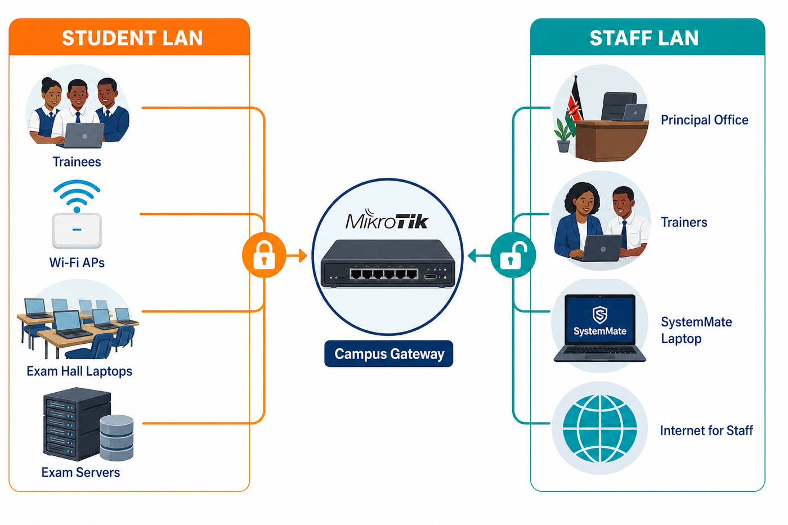
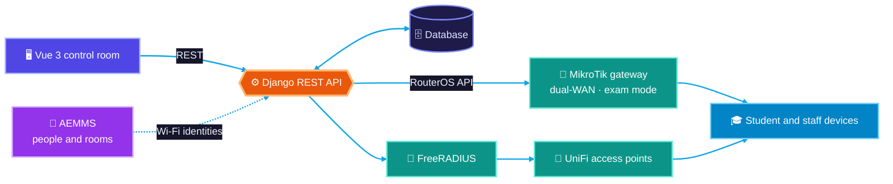
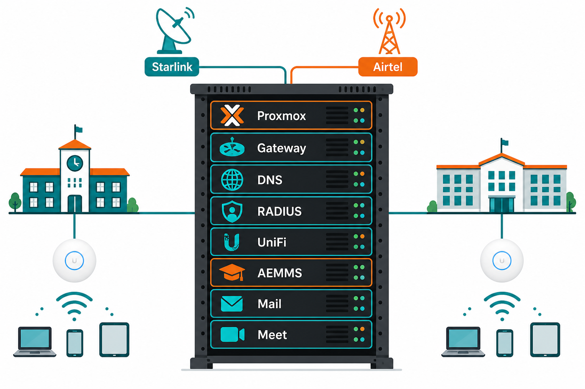
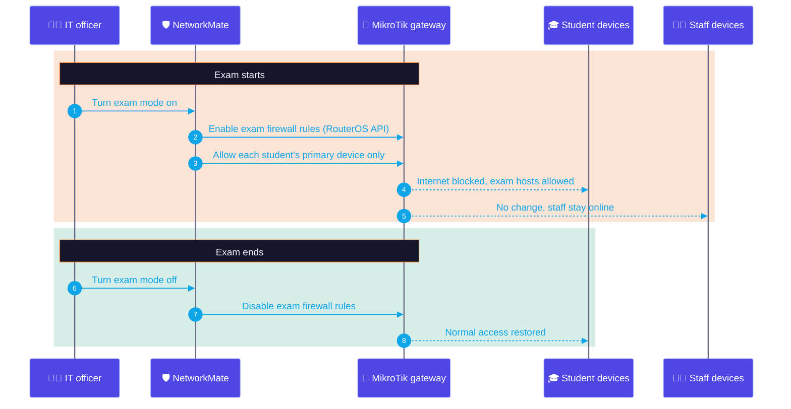

<picture>
  <source media="(prefers-color-scheme: light)" srcset="assets/theme/hero-light.svg"/>
  
</picture>

  A web control room for school and campus networks: identity Wi-Fi, device control, and one-click exam lockdown on MikroTik and FreeRADIUS. 
  Designed and built by <a href="https://github.com/flowser"><b>Eng. Felix Nyachio</b></a>, Savvytex Marines Ltd.

  
  
  
  
  
  
  
  

> **This is a showcase repository.** The source code is private and in production use. A live walkthrough is available on request — [get in touch](#contact).

## The problem

On most campuses the Wi-Fi password is shared, nobody knows which device belongs to whom, and during exams the only way to stop students going online is to switch the internet off for everyone, including the principal's office.

## What NetworkMate does

| Capability | Details |
|---|---|
| **Identity Wi-Fi** | Every student signs in with their own credentials (imported from the college roster) through FreeRADIUS and UniFi. No shared passwords. |
| **Device control** | Detects connected devices, links them to students, flags unauthorised hardware, and applies per-user device limits. |
| **Exam mode** | One switch blocks student internet, keeps approved exam servers reachable, enforces device limits, and leaves staff online. |
| **Separate lanes** | Student and staff networks run on separate paths, so lockdown never silences administration. |
| **Session tracking** | Logs who connected, when, on which device, and for how long. |
| **Router integration** | Talks to MikroTik RouterOS/CHR to monitor health and push policy, so IT clicks a screen instead of editing router configs. |

  
   Student and staff lanes through one campus gateway

## Architecture

  
   Production deployment: dual-WAN uplinks and campus services on one Proxmox host

### Exam mode, step by step

## Engineering highlights

- **Layered backend:** Django REST Framework organised as controllers → services → repositories → models, with serializers at the edge.
- **Network as code, behind a UI:** router and RADIUS changes are driven from the API, so exam-mode transitions are repeatable and audited.
- **Runs anywhere:** Docker Compose locally; Proxmox on campus; GitHub Actions CI.
- **Built for handover:** operations runbooks so the client's IT team can run it without the vendor.

## Stack

| Layer | Technologies |
|---|---|
| Backend | Python, Django REST Framework |
| Frontend | Vue 3, Vite, TypeScript |
| Network | MikroTik RouterOS / CHR, FreeRADIUS, UniFi OS, BIND |
| Data | MySQL / PostgreSQL |
| Infrastructure | Docker Compose, Nginx, Proxmox VE, GitHub Actions |

## In production

Deployed at a teacher-training college in Kenya as part of a full campus build: dual-WAN (Starlink + Airtel), identity Wi-Fi at roster scale, exam lockdown, and self-hosted services. Read the [campus network case study](https://github.com/flowser/flowser/blob/main/case-studies/chesta-campus-network.md).

## Contact

Need your campus or office network brought under control?

  
  
  

© 2026 Savvytex Marines Ltd. All rights reserved. Diagrams may not be reused without permission.
